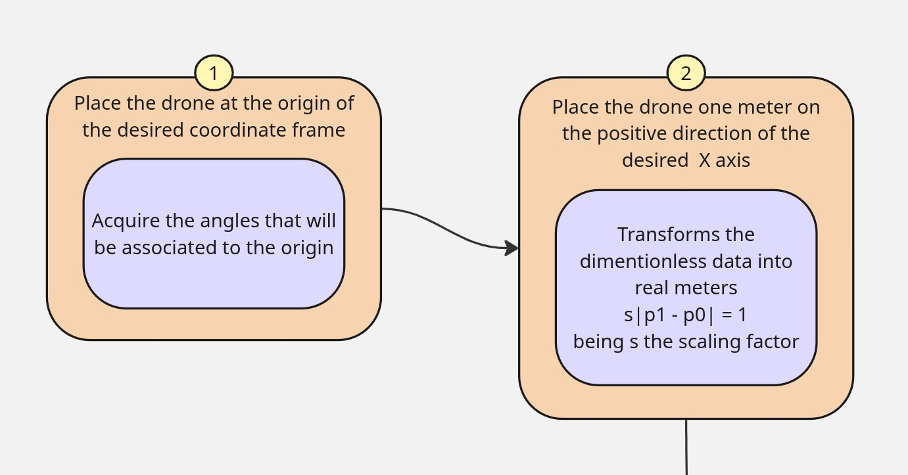

# Bitcrazy Calibration Procedure

## Calibration Steps




# Lighthouse Calibration Tools

Standalone calibration tools that reuse the calibration pipeline from the Qt-based wizard as a command-line interface and Python library.

## Overview

This toolkit provides two main ways to calibrate your lighthouse base station geometry:

1. **CLI Tool** (`calibrate_lighthouse_cli.py`) - for automated calibration workflows
2. **Python API** (`calibrate_lighthouse_example.py`) - for integration into your own tools

Both use the same underlying calibration pipeline:
- Match angle measurements into pose samples
- Build initial geometry estimate using IPPE
- Refine with least-squares optimization
- Align to world frame
- Scale using reference measurements

## Installation

The calibration scripts use only the existing lighthouse modules in this directory. No additional installation needed if you have the base dependencies.

**Requirements:**
- numpy
- scipy
- PyYAML (for configuration output)
- pymavlink (for TUNNEL capture)

The geometry types and IPPE implementation used by this standalone pipeline are
included in this repository; `cflib` is not required.

## Usage

### Live capture over MavESP8266 Wi-Fi

The firmware sends complete raw-angle snapshots in MAVLink `TUNNEL` messages.
The TUNNEL v2 payload also carries the age of each of the eight sensor/base-station
angles. Flash the current `rp2350_firmware/src/build/crossing_beams.uf2` before
capturing; older firmware does not include this timing metadata and its JSON
cannot be used by the age-filtered solver.
MavESP8266 sends telemetry to UDP port 14550 and learns the calibration
computer's address from its GCS heartbeat. In AP mode, capture with:

```bash
py -3.11 utils/calibration/calibrate_lighthouse.py \
  --udp 0.0.0.0:14550 --heartbeat-to 192.168.4.1:14555 \
  -o measurements.json
```

Move the four-sensor wand through the calibration volume and press Ctrl-C when
enough samples have been collected. The resulting JSON is the same input used
by the existing geometry solver. For station mode, replace `192.168.4.1` with
the MavESP8266 IP. Adjust UDP ports if its `WIFI_UDP_HPORT` or
`WIFI_UDP_CPORT` parameters differ from the defaults. The stream contains
instantaneous angles, not the EMA-filtered angles used for runtime position
solving.

### Solve lighthouse geometry

`wand_sensors.json` contains the measured 4 × 4 cm sensor layout in
**S0, S1, S2, S3 order**. From the component side, the current PCB maps S0 to
the upper-left sensor (D1/E1), S1 to upper-right (D2/E2), S2 to lower-right
(D3/E3), and S3 to lower-left (D4/E4). Coordinates are in metres relative to
S0; X points right and Y down in that view. Verify that this matches the
assembled board before solving.

```powershell
Copy-Item utils/calibration/wand_sensors.example.json utils/calibration/wand_sensors.json
```

Capture a broad set of wand positions and moderate orientations, keeping all
four sensors visible to both stations whenever possible. Then solve:

```bash
py -3.11 utils/calibration/calibrate_lighthouse.py \
  --solve measurements.json \
  --sensor-positions utils/calibration/wand_sensors.json \
  --height 3.45 \
  --geometry-output lighthouse_geometry_candidate.yaml
```

`--baseline` is optional. Without it, the script initializes from the baseline
estimated from the angle data and reports the final estimate. To check only the
distance, without fitting/exporting lighthouse poses or supplying a height, use:

```bash
py -3.11 utils/calibration/calibrate_lighthouse.py \
  --baseline-only measurements.json \
  --sensor-positions utils/calibration/wand_sensors.json
```

For a comparison against a tape-measured baseline, add `--baseline 2.26`; this
is a reference value, not a required calibration input.

The solver uses only timestamps containing complete measurements from both
base stations whose eight angles are each no older than 100 ms and whose age
spread is no more than 50 ms. These limits can be changed with
`--max-angle-age-ms` and `--max-angle-skew-ms`. The solver triangulates the wand
sensors, builds rigid wand poses, then refines lighthouse and wand poses with
the Bitcraze least-squares solver. A measured baseline, if supplied, is only an
initial reference; the estimated baseline is reported separately. BS4 is placed
at `(0, 0, height)` and the boresights define world up.

The output is a candidate only. Check that the synchronized sample count is
large enough, the estimated baseline is close to the physically measured value,
the residual is low, and the reported poses match the actual mounting. To make
a candidate firmware header without replacing the active one:

```bash
py -3.11 utils/calibration/calibrate_export.py \
  --yaml lighthouse_geometry_candidate.yaml \
  -o bs_poses_cal_candidate.h
```

Do not flash that header until its positions and boresight directions have been
checked against physical measurements. The legacy `calibrate_cli.py` acquires
data through Crazyflie and is not the JSON solver for this Wi-Fi capture path.

### Drone auto-calibration — Bitcraze wizard (`capture_lh2.py` + `calibrate_bitcraze.py`)

There is no separate wand: the drone's own 4-sensor board is the calibration
target. `wand_sensors.json` is that board (40 mm square, S0 upper-left (D1/E1), S1
upper-right, S2 lower-right, S3 lower-left, seen from the component side). Both
scripts use it by default. The drone's reference point is the **centre of the four
sensors**.

**What you need:** the AUTO-CALIB-EXP firmware (or later) on the Pico, a tape
measure, and floor tape. Mark these on the floor:
- an **origin** point, which becomes (0, 0, 0);
- an **x-axis** point exactly **1 m** from the origin, in the direction that becomes +X;
- **3 other floor points**, spread out and not on the X axis.

**1. Capture (guided).** Run the wizard for the link the drone uses:

| Link | Command |
|---|---|
| Wi-Fi (MavESP8266 / DroneBridge AP), the AUTO-CALIB-EXP setup | `python capture_lh2.py --connect udpin:0.0.0.0:14550 --heartbeat-to 192.168.4.1:14555` |
| Telemetry radio (SiK) | `python capture_lh2.py --connect /dev/ttyUSB0 --baud 57600` (Windows: `COM5`) |
| Flight controller USB | `python capture_lh2.py --connect /dev/ttyACM0 --baud 115200` |
| Pico UART0 → USB-UART adapter, no FC | `python capture_lh2.py --connect /dev/ttyUSB0 --baud 115200` |
| TCP (MAVProxy / Mission Planner forward) | `python capture_lh2.py --connect tcp:192.168.4.1:5760` |

It prompts for each step. Put the drone in place, press Enter, and keep it still for 5 s:

1. **Origin**: drone flat on the floor, sensor centre on the origin mark.
2. **X-axis**: the same, on the 1 m mark.
3. **Floor 1–3**: the same, on each of the other floor marks.
4. **Sweep**: pick the drone up and walk it slowly through the whole flight volume for
   2–3 minutes. Cover low, middle and high, tilt it ±30°, and turn it to many headings.
   All four sensors must stay visible to both stations. Press Ctrl-C to finish.

A static step that gets fewer than 10 good snapshots is repeated. Everything is saved
in a session directory (`calib_<date>_<time>/`, with `session.json` listing the files).
Watch the live "physically plausible" percentage. If it stays low, the decoder problem
described below is present.

Through a flight controller, ArduPilot only forwards the TUNNEL to a link on which it
has seen the GCS (sysid 255 / compid 190). The script sends that heartbeat every
second. The Pico's FC port must use MAVLink 2 (e.g. `SERIAL2_PROTOCOL = 2`). If nothing
arrives, the script lists the message types it *did* hear.

**2. Solve.**

```bash
python calibrate_bitcraze.py calib_20261009_101500/ --baseline 2.26
```

The steps follow Bitcraze. The sample matcher pairs the stations' readings. The IPPE
estimator makes a planar initial guess for each sample, resolving the mirror ambiguity
by clustering. Their sparse least-squares solver refines it. The aligner then sets the
frame (origin → (0, 0, 0), x-axis capture → +X, floor captures → Z = 0), and the scaler
rescales so the x-axis capture is exactly 1 m away. One extra step not in Bitcraze:
after the first solve, every sample is re-admitted with a drone pose triangulated from
the solved stations, and the solve is repeated. Without it, IPPE rejects most samples
when the stations point straight down.

Z = 0 is the **sensor plane** while the drone sits on the floor. Add
`--board-height <m>` (the height of the sensors above the floor) to make Z = 0 the floor itself.

Check the printout:
- **Residual** and **wand shape check**: a few mm. Centimetres mean a wrong sensor
  order or layout.
- **"x-axis capture is … m by the sensor-spacing scale"**: this should be about 1.0 m. If it
  isn't, either the 1 m mark is misplaced or the sensor spacing in the JSON is wrong.
- **Estimated baseline** vs the tape-measured `--baseline`: within about 3 %.
- **Poses**: right heights, and boresights that match how the stations are mounted.

**Same flow from the browser** (Crazyflie-client-style wizard). Run
`python utils/user_interface/display_real_time_windows.py` and open `bs_pose_editor.html` → **Calib**.
- *Base station status* shows, per station, Receiving (all four sensors seen), Calibration (OOTX
  data in `lh2_factory_calibration.json`) and Geometry (solved in this session).
- *Sample collection*: Origin, X-axis, any number of XY-plane samples, XYZ-space (the sweep;
  every recording is appended to `sweep.json`) and optional Verification samples
  (`verify_<n>.json`, never given to the solver). The first measurement creates
  `calib_runs/run_<date>/`.
- With origin, x-axis, ≥ 1 xy-plane and ≥ 100 sweep snapshots the session is solved in the
  background (`calibrate_bitcraze.py` → `geometry.yaml` + `solve.log`, same files as the
  wizard) and re-solved when an estimation sample changes. `locate_samples.py` then places
  every sample with the solved geometry: the 3D view shows them with the solved stations, and
  the board-fit error of the verification samples is the *max verification sample error*.
- *Sample management*: per-sample details and delete (files go to `_deleted/`), Clear all
  (to `_cleared_<date>/`), Import / Export of all samples as one JSON file.
- *Geometry result* grades the report (residual, board fit, 1 m mark, baseline vs tape, station
  tilt vs the OOTX accelerometer), applies the poses to the editor, and **Export header** runs
  `calibrate_export.py` into `<run>/bs_poses_cal_candidate.h`. *Settings* holds the link, tape,
  board height, the `reconvert_run.py` option for old-firmware sessions, and **Open run**.

**3. Into the firmware** (this branch compiles the poses in):

```bash
python calibrate_export.py --yaml lighthouse_geometry_candidate.yaml -o bs_poses_cal_candidate.h
```

Compare it with `rp2350_firmware/src/bs_poses_cal.h`. If it's right, copy it over,
rebuild both UF2s, flash, and commit.

Other modes: `capture_lh2.py --raw -o file.json` records free motion only. Solve such a
file with `--auto-frame --height 3.45` (BS0 at (0, 0, height), +X toward BS1), or pass
loose static files with `--origin/--x-axis/--xy-plane`.

Check the pipeline against a known geometry first:

```bash
python make_synthetic_measurements.py --session synth_session
python calibrate_bitcraze.py synth_session --baseline 2.26 --truth synth_session/truth.json
```

#### Sensor geometry

`--sensor-positions` is the **only metric reference** in the whole solve.

- **Scale.** Any error in the sensor spacing scales every station position by the same
  factor, and the residual stays just as low. A 5 cm wand entered as 4 cm shrinks a
  2.26 m baseline to 1.80 m. Always pass a tape-measured `--baseline`: the script
  then prints the spacing correction the data implies. Note that
  `wand_sensors.json` says 40 mm, while `yaw/yaw.c` (`SENSOR_BASELINE`) and the
  synthetic firmware assume 50 mm. Only one of them can be right.
- **Order.** Rows must follow firmware sensor order S0..S3. Any rotation or mirror image
  of the square fits equally well. A non-cyclic order, such as S2 and S3 swapped,
  fails the "wand shape check" (median rigid-fit error in the centimetres).
- **Planarity.** IPPE is a planar estimator. The file must be coplanar to within 2 mm.
- **Reference point.** The layout is centred on its sensor centroid before solving
  (the Crazyflie deck is already centred). Otherwise the origin / x-axis marks would
  refer to S0, which `wand_sensors.json` puts at (0, 0, 0).
- **Centring in IPPE.** Upstream Bitcraze `_ippe.py` centred 3D models with a scalar
  (`np.mean(U[:1])`) and did not guard against reflections. That worked for the
  Crazyflie deck, which is centred on its origin, but returned det = −1 "rotations"
  for this wand, whose S0 is at (0, 0, 0). Both bugs are fixed in `calibration_lib/_ippe.py`.

#### Data quality gate

Records whose 4 sensors span more angle than the board can subtend at
`--min-wand-distance` (default 0.5 m) are dropped, since at least one angle in them is corrupt.
In the current captures (`measurements*.json`), **95–99.9 % of snapshots fail
this gate**. When the wand is held still, the angles repeat to about 0.01°, but individual
sensors' *vertical* angles sit ±4–12° away from the others, while the horizontal
angles agree to within about 1°. A 4 cm wand at about 3 m spans about 0.8°. The vertical angle comes
from the difference between the two sweeps, so this points to a per-sensor sweep pairing or decode
problem in the firmware. No solver can calibrate from that data; fix the decoder
and recapture.

The shape of the error is a clue. About ±8° vertical but only about ±0.5° horizontal
means both sweeps of one sensor are shifted by about 4.6° in *opposite* directions.
An error in a single sweep would move the horizontal angle by about half as much as the
vertical. That rules out the linear `CAL_BS*` constants and a plain sweep-0/1 swap. To diagnose
it, keep the drone still and log the USB `L,<sensor>,<bs>,<sweep>,<poly>,<lfsr>,<t>`
lines: for one base station, the four sensors' LFSR counts should differ by only
a few hundred counts within each sweep.

### CLI: With Custom World Frame

Define your own world frame using reference points:

```bash
./calibrate_lighthouse_cli.py measurements.json \
  --origin 0 0 0 \
  --x-axis 1 0 0 \
  --xy-plane 0 1 0 \
  -o lighthouse_config.yaml
```

### CLI: Verbose Output

For debugging and understanding the calibration process:

```bash
./calibrate_lighthouse_cli.py measurements.json -o lighthouse_config.yaml -v
```

### Python API: Programmatic Usage

For integration into your own applications:

```python
from calibrate_lighthouse_cli import LighthouseCalibrator
import numpy as np

calibrator = LighthouseCalibrator(verbose=True)
success = calibrator.calibrate(
    'measurements.json',
    'output_config.yaml',
    origin=np.array([0, 0, 0]),
    x_axis=[np.array([1, 0, 0])],
    xy_plane=[np.array([0, 1, 0])]
)
```

See `calibrate_lighthouse_example.py` for more detailed examples.

## Measurement Format

Measurements should be saved as JSON with the following structure:

```json
[
  {
    "timestamp": 0.123,
    "base_station_id": 0,
    "angles": [
      [horizontal, vertical],
      [horizontal, vertical],
      [horizontal, vertical],
      [horizontal, vertical]
    ]
  },
  ...
]
```

Where:
- `timestamp`: Time when measurement was taken (float, in seconds)
- `base_station_id`: Which lighthouse base station (0, 1, ...) 
- `angles`: 4 sensor angle pairs in **radians**
  - Each pair is [horizontal_angle, vertical_angle]
  - Horizontal: 0 = straight ahead, positive = left, negative = right
  - Vertical: 0 = straight ahead, positive = up, negative = down

### Collecting Measurements from Crazyflie

Use the `LighthouseSweepAngleAverageReader` from the calibration module to collect measurements. Here's a minimal example:

```python
from lbees.indoor.calibration import LighthouseSweepAngleAverageReader
from lbees.indoor.calibration.lighthouse_types import LhMeasurement
import json
import time

measurements = []
cf = your_crazyflie_instance  # Already connected

def measurement_ready(averages):
    for bs_id, (count, angles) in averages.items():
        measurements.append({
            'timestamp': time.time(),
            'base_station_id': bs_id,
            'angles': [
                [v.lh_v1_horiz_angle, v.lh_v1_vert_angle]
                for v in angles
            ]
        })

reader = LighthouseSweepAngleAverageReader(cf, measurement_ready)
reader.nr_of_samples_required = 50

# Move the Crazyflie around and collect measurements
reader.start_angle_collection()
# ... move CF to different positions ...
# When enough samples collected, measurement_ready() is called automatically

# Save to file
with open('measurements.json', 'w') as f:
    json.dump(measurements, f)
```

## Calibration Pipeline Details

### 1. Match Measurements
Aggregates angle measurements that occur at approximately the same time into pose samples. Parameters:
- `max_time_diff`: Maximum time span to group measurements (default 20ms)
- `min_nr_of_bs_in_match`: Minimum base stations per sample (default 2)

### 2. Initial Estimate (IPPE)
Uses Infinitesimal Plane-Based Pose Estimation to compute an initial guess of base station poses. Automatically handles the two mirror solutions from IPPE and picks the correct one by clustering.

### 3. Geometry Solving
Iterative least-squares optimization to refine poses. Minimizes the error between measured angles and projected angles based on estimated poses. Converges to a solution or stops after max iterations.

### 4. Alignment
Transforms the coordinate system so that:
- Origin is at specified position
- X-axis points through specified x_axis points
- XY-plane contains specified xy_plane points

This allows you to define your own world frame.

### 5. Scaling
Adjusts the scale of the entire system to match real-world measurements. Two methods:
- **Diagonal spacing** (default): Uses the known physical spacing between lighthouse deck sensors as reference
- **Fixed point**: Uses a known distance to a measured position

## Output Format

The output is a YAML file containing base station geometry that can be loaded into the Crazyflie:

```yaml
type: lighthouse_system_configuration
version: '1'
systemType: 2
geos:
  0:
    # Base station 0 geometry
    position: [x, y, z]
    ...
  1:
    # Base station 1 geometry
    ...
calibs: {}
```

## Examples

### Complete Calibration Workflow

See `calibrate_lighthouse_example.py` for:
- Basic calibration with default parameters
- Custom world frame definition
- File-based calibration workflow
- Collecting measurements from actual Crazyflie

Run the examples:
```bash
python calibrate_lighthouse_example.py
```

### Integration with Existing Code

The calibration modules can be imported and used independently:

```python
from lbees.indoor.calibration.lighthouse_sample_matcher import LighthouseSampleMatcher
from lbees.indoor.calibration.lighthouse_initial_estimator import LighthouseInitialEstimator
from lbees.indoor.calibration.lighthouse_geometry_solver import LighthouseGeometrySolver
from lbees.indoor.calibration.lighthouse_system_aligner import LighthouseSystemAligner
from lbees.indoor.calibration.lighthouse_system_scaler import LighthouseSystemScaler

# Use them in your own applications
```

## Architecture

The calibration pipeline is built from reusable modules:

- **`lighthouse_types.py`** - Core data structures (Pose, LhMeasurement, LhCfPoseSample)
- **`lighthouse_sample_matcher.py`** - Aggregates measurements into pose samples
- **`lighthouse_initial_estimator.py`** - IPPE-based initial pose estimation
- **`lighthouse_geometry_solver.py`** - Least-squares geometry refinement
- **`lighthouse_system_aligner.py`** - World frame alignment
- **`lighthouse_system_scaler.py`** - System scaling
- **`lighthouse_bs_vector.py`** - Angle representation and conversions
- **`ippe_cf.py`** - IPPE solver interface

Each module is independent and can be used in isolation.

## Troubleshooting

### "Too little data, no reference" Error
You need measurements from at least 2 base stations. Ensure your measurements contain observations from multiple base stations with at least 2-3 samples each.

### Solver Did Not Converge
This often means:
- Too few measurements
- Measurements have high noise
- Base stations are too far apart
- Try collecting more measurements at different positions

### Large Error Values
If mean error is unusually large:
- Check that your angle measurements are in radians, not degrees
- Ensure sensor positions are correct (device-specific)
- Verify timeline - measurements should span a few seconds

### Unrealistic Base Station Positions
If base stations appear upside-down or mirrored:
- Use custom `--x-axis` and `--xy-plane` to specify your physical setup
- Or collect more samples to improve disambiguation

## Contributing

To improve the calibration:
- Test with real measurements from your environment
- Report measurement quality or convergence issues
- Save example measurement files for debugging

## License

GNU General Public License v3.0 - See LICENSE file
